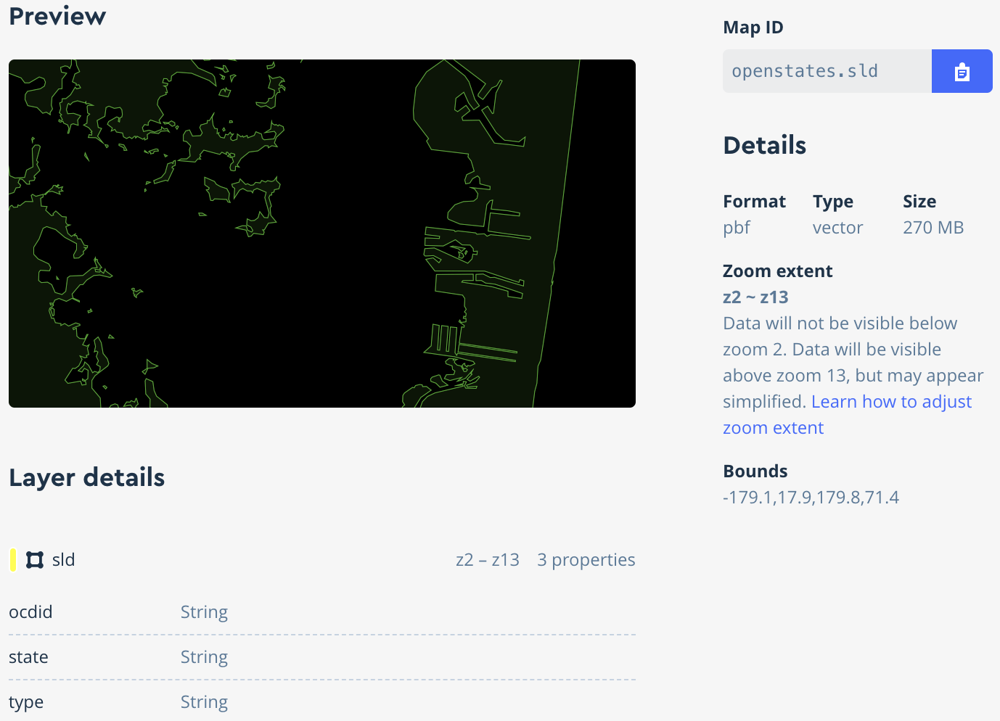

# Issues

- Tracked in our central issue repository: [Geo Issues](https://github.com/openstates/issues/labels/component%3Ageo)

# Open States Geography Processing & Server

Generate and upload map tiles for the state-level legislative district maps on [openstates.org](https://openstates.org/), both for [state overviews](https://openstates.org/ca/) and for [individual legislators](https://openstates.org/person/tim-ashe-4mV4UFZqI2WsxsnYXLM8Vb/).

- Source: SLDL and SLDU shapefiles from [the Census's TIGER/Line database](https://www.census.gov/geo/maps-data/data/tiger-line.html)
- Output: a single nationwide MBTiles vector tile set, uploaded to Mapbox for hosting
  - Intermediate files are also built and retained locally, stored in the `data` directory for debugging



## Dependencies

- Python 3 and `poetry`
- GDAL 2
- `curl`
- `tippecanoe`
- `unzip`

## Running

There are several steps, which typically need to be run in order:

1) Setup Poetry:

  `poetry install`

2) Download SLD shapefiles:

  `poetry run ./scripts/get-shapefiles.py`

3) Convert to geojson with division IDs:

  `poetry run ./scripts/to-geojson.py`

4) Import into database:

  `poetry run ./manage.py load_divisions`

5) Convert to mbtiles and upload:

  `./scripts/make-tiles.py`

  The `MAPBOX_ACCOUNT` name and `MAPBOX_ACCESS_TOKEN` (with upload privileges) must be set as environment variables. If not, then the upload step will be skipped.

### Running within Docker

Instead of setting up your local environment you can instead run using Docker. Using Docker Compose will still allow you to access all intermediate files from the processing, within your local `data` directory.

Build and run with Docker Compose. Similar to running without Docker, the `MAPBOX_ACCOUNT` and `MAPBOX_ACCESS_TOKEN` must be set in your local environment.

```
docker-compose up make-tiles
```
